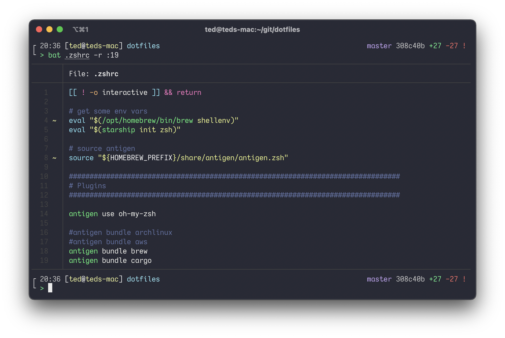

<div align="center">
  <h1><code>dotfiles</code></h1>

  <p>
    <strong>Ted's dotfiles.</strong>
  </p>

  <!--  -->
</div>

# Installation

- Install nix

  ```sh
  sh <(curl -L https://nixos.org/nix/install)
  ```

- Clone the repo

  ```sh
  nix-shell -p nixUnstable gh

  gh repo clone tedbyron/dotfiles ~/dotfiles -- --depth 1
  ```

- Symlink `/run` to `/private/var/run` for nix-darwin

  ```sh
  echo -e "run\tprivate/var/run" | sudo tee -a /etc/synthetic.conf

  /System/Library/Filesystems/apfs.fs/Contents/Resources/apfs.util -t
  ```

- Build a configuration from the flake

  ```sh
  cd ~/dotfiles

  nix build .#darwinConfigurations.<CONFIG_NAME>.system \
    --experimental-features 'nix-command flakes'
  ```

- Switch to the configuration

  ```sh
  ./result/sw/bin/darwin-rebuild switch --flake .
  ```

# Troubleshooting

- SSL error

  <https://nixos.org/manual/nix/stable/installation/env-variables.html#nix_ssl_cert_file-with-macos-and-the-nix-daemon>

# Nix stuff

- Dead code elimination

  ```
  nix run nixpkgs#deadnix
  ```

- Lint

  ```
  nix run nixpkgs#statix
  ```
